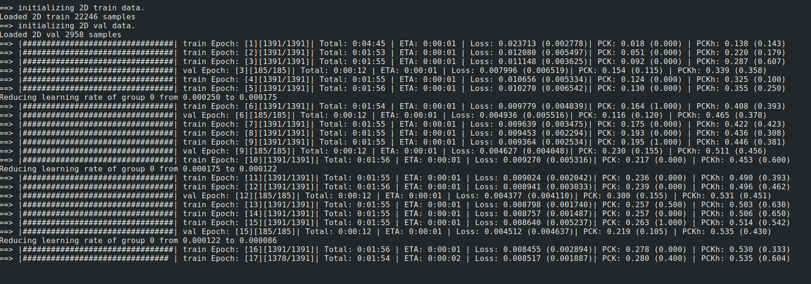

## Networks Implemented
* [DeepPose: Human Pose Estimation via Deep Neural Networks](https://static.googleusercontent.com/media/research.google.com/en//pubs/archive/42237.pdf) :
  
## Datasets
* [MPII](http://human-pose.mpi-inf.mpg.de/)

## Requirements
* pytorch == 0.4.1
* torchvision ==0.2.0
* scipy
* configargpare
* progress
* json_tricks
* Cython

## Installation & Setup
`pip install -r requirements.txt`

For setting up MPII dataset please follow [this link](https://github.com/princeton-vl/pose-hg-train#getting-started) and update the `dataDir` parameter in [mpii.defconf](./conf/datasets/mpii.defconf) configration file. Also please download and unzip [this folder](https://www.cse.iitb.ac.in/~namanjain/mpii.zip) and updates the paths for `worldCoors` & `headSize` in the config file.

For setting up COCO dataset please follow [this link](https://github.com/Microsoft/human-pose-estimation.pytorch#quick-start) and update the `dataDir` parameter in [coco.defconf](./conf/datasets/coco.defconf)

## Usage
There are two important parameters that are required for running, `DataConfig` and `ModelConfig`. 
Corresponding to both datasets (MPII & COCO) config files are provided in the `conf/datasets` folder. 
Corresponding to all models implemented config files are provided in `conf/models` folder. 

To train a model please use
```
python main.py -DataConfig conf/datasets/[DATA].defconf -ModelConfig conf/models/[MODEL_NAME].defconf
-ModelConfig config file for the model to use
-DataConfig config file for the dataset to use
```

To continue training a pretrained model please use
```
python main.py -DataConfig conf/datasets/[DATA].defconf -ModelConfig conf/models/[MODEL_NAME].defconf --loadModel [PATH_TO_MODEL]
-ModelConfig config file for the model to use
-DataConfig config file for the dataset to use
--loadModel path to the .pth file for the model (containing state dicts of model, optimizer and epoch number)
(use [-test] to run only the test epoch)
```

Further options can (and should!) be tweaked from the model and data config files (in the `conf` folder).

The training window looks like this (Live-Updating Progress Bar Support): 


To download the pretrained-models please use [this link](https://www.cse.iitb.ac.in/~namanjain/models.zip).

## PreTrained Models
DeepPose |  MPII | PCKh : 54.2


